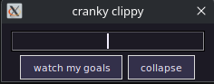
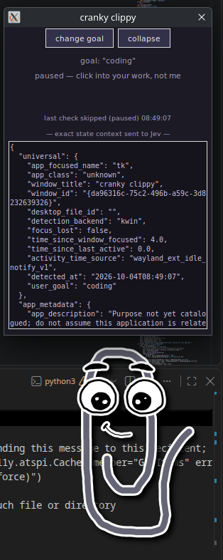

# cranky-clippy

This is Cranky Clippy. He's happy for now, but he won't be for much longer if you get distracted. NOTE: It only works on desktop Linux. It's borked on MacOS and Windows. todo...?


If you find yourself getting easily distracted from the study/work goals that you set for yourself, you probably are in need of a motivator. **Cranky Clippy** is like the OG Clippert from the 90s versions of Word, but he lives on your desktop, and feeds on your productivity. He gets really, really mad if you dare distract yourself. So much so that he *will* take action to make sure you stay focused.


## How it works

1. Launch the program after setup with `python3 RUNTHISONE.py`; you'll see this window appear.

   

2. Get to work! he'll get angry lest you get distracted.

   

Note: you can hide the debug menu with the **collapse** button. You can kill Cranky Clippy by simply clicking the debug window's close button.

## How to set it up

### 1. Install dependencies

```sh
sudo apt update
sudo apt install python3 xwayland python3-venv python3-tk python3-gi python3-dbus \
  gir1.2-atspi-2.0 at-spi2-core
```

### 2. Create a virtual environment and install PySide6

```sh
python3 -m venv --system-site-packages .venv
source .venv/bin/activate
python -m pip install --upgrade pip
python -m pip install PySide6
```

### 3. Set up the API keys

Create or copy an API key from each provider:

- Jev from OpenRouter: <https://openrouter.ai/keys>
- Gemini: <https://aistudio.google.com/apikey>
- ElevenLabs: <https://elevenlabs.io/app/settings/api-keys>

Copy `.env.local.example` to `.env.local` and paste each key after its matching
name (`OPENROUTER_API_KEY`, `GEMINI_API_KEY`, and `ELEVENLABS_API_KEY`):

```sh
cp .env.local.example .env.local
chmod 600 .env.local
```

`.env.local` is ignored by Git. Environment variables with the same names take
precedence over values in that file.

### 4. Install the browser extension (optional, for returning to the exact tab)

First register the native messaging host:

```sh
python3 browser_extensions/install_native_hosts.py
```

- **Chrome:** Open `chrome://extensions`, enable **Developer mode**, select **Load unpacked**, and choose the repo's `browser_extensions/chrome` folder.
- **Firefox:** Open `about:debugging#/runtime/this-firefox`, select **Load Temporary Add-on**, and choose `browser_extensions/firefox/manifest.json`. Firefox temporary add-ons must be loaded again after Firefox restarts.

This lets Cranky Clippy return you to the last on-task browser tab. Without the extension, it can fall back to opening the saved URL in a new tab.

### 5. Run the program

```sh
python3 RUNTHISONE.py
```


By the way; there are API keys in the git history. these have already been rotated. NO FREE API FOR YOU!!!
Also, for anyone not viewing this from StormHacks 2026, yeah that's what this was for. this entire thing was made in 24 hours (less, even)
